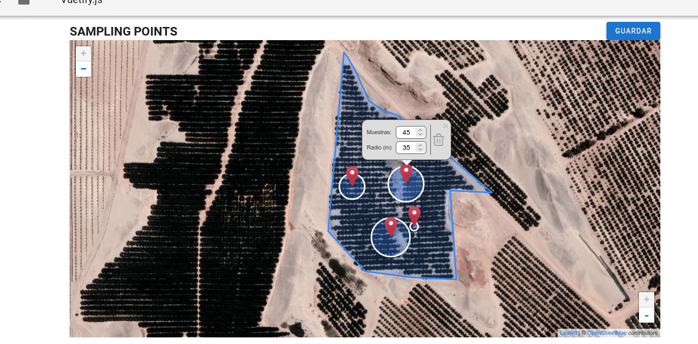
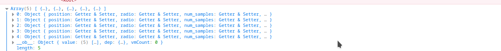

# spaceLeaflet

## Demo: [https://todoreact-kevo.netlify.app/](https://todoreact-kevo.netlify.app/)

## Build Setup

$ npm install

$ npm run dev

$ npm run build

## About

- Objetivo: 
    >Construir una interfaz de mapa para definir puntos de muestreo dentro de un polígono .

- Tecnologías:
    > Proyecto desarrollado con VueJs y LeaftLe (https://vue2-leaflet.netlify.app) con NuxtJs.

- Detalles: 
    > En base a un geoJson rendediramoz un poligono, dentro podemos hacer click y dejar un marcador haciendo click en Guardar.

    > Cada que se hace click en el boton Guardar se muestra la información de los marcadores guardados en la consola.

    > La opción de eliminar solo se activa cuadno se guardo un maker.

    > Generé un componente Marker Custom para mostrar el arrar con makers.

    > Use Sass y Vuetify

 ### Capturas
 

 

Salida por consola:

<h3 align="left">Connect with me:</h3>

<h3 align="left">Languages and Tools:</h3>

    
